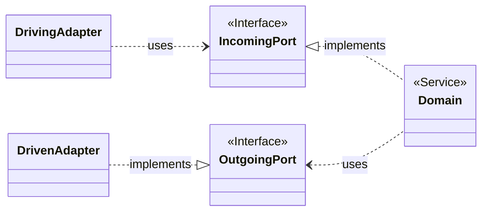
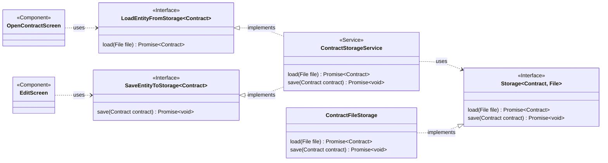
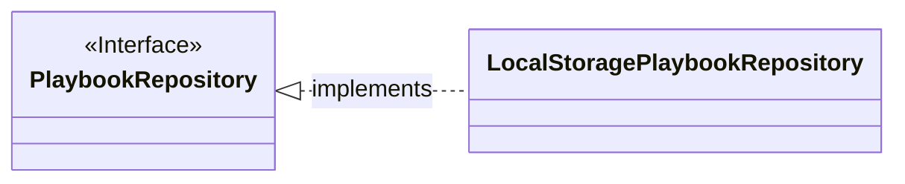
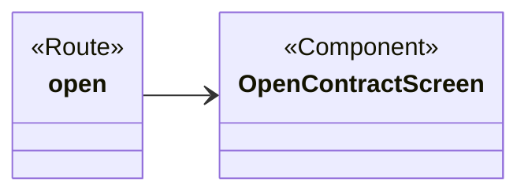

# Architecture

## Ports & Adapters

Following domain-driven design principles the application is built implementing the Ports and Adapters (Hexagonal) architecture:

<br>
<br>



<br>
<br>

The core domain package in the center has no outwards pointing dependencies whatsoever and input/output can only reach/leave it through ports, that is interfaces provided by the core; these interfaces in turn are to be implemented by adapters in the infrastructure layer surrounding it.

The application's source code is structured accordingly, with the following main packages:

- `components`: Vue.js based UI, primary/driving adapters
- `domain`: domain entities/business logic
- `infra`: persistence, secondary/driven adapters
- `routes`: URL <> View mapping for the Vue.js SPA
- `session.ts`: maintain current work in progress, backed by `sessionStorage` to prevent data loss when reloading
- `provide.ts`: injects concrete implementations for ports

<br>
<br>

### File-based storage

Implementation for loading/saving contracts (playbooks analog):



### Repositories

Built-in playbooks are kept in a repository:

<br>
<br>



<br>
<br>

Again, the repository is represented as port via an interface for components depending upon it. This allows to exchange the actual implementation of the repository (say from `localStorage` to an API backed repo) without touching the domain at all.

## Routing

Routes are high-level Vue.js components with the sole responsibility of providing a mapping from current URL to a particular screen:

<br>
<br>



<br>
<br>

Each `.vue` file in the `routes` package maps to a particular screen (i.e. component). More information: https://github.com/hannoeru/vite-plugin-pages

<br>
<br>

## Architecture Decision Records

The `docs/adr` directory contains [architecture decisions](https://cognitect.com/blog/2011/11/15/documenting-architecture-decisions).
For adding new records the [adr-tools](https://github.com/npryce/adr-tools) command-line tool is useful but not strictly necessary:

```bash
brew install adr-tools
```
